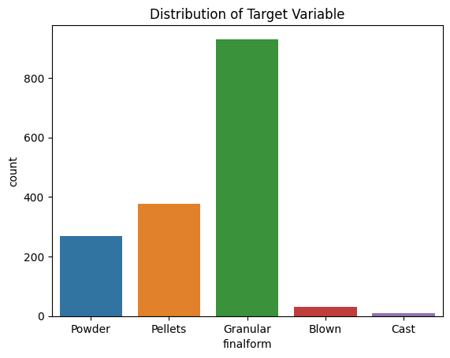

# Predicting the Physical Form of Polymer Samples
 
# Objective
The goal is to predict the physical form of polymer samples based on laboratory measurements of the particle density and bulk density of the samples. 

# Hypothesis
Both both bulk density and particle density measurements can be used to accurately predict the physical form of polymer samples. By training a classification model on the labeled data, the aim is to predict the physical form of the unlabeled samples. It is expected that feature importance analysis will reveal which type of density measurement is more predictive of the sample's physical form.

# Data
The dataset contains two types of measurements: bulk density (measured in lb/ft³), which includes the empty spaces between particles, and particle density (measured in g/cm³), which measures only the polymer material itself. Each sample is uniquely identified and may have been tested multiple times.

The physical form of the samples, such as powder or pellets, is provided in a separate file. However, not all samples have this label. The challenge is to predict the physical form for these unlabeled samples.

The dataset exhibits class imbalance across five classes as shown below: powder, pellets, granular, brown, and cast.

## Data Preprocessing
The data preprocessing involved several steps to ensure it was suitable for modeling. Initially, there were no missing values in the dataset, but two duplicate entries were identified and removed. The data was structured such that each sample had two rows, one for each type of density measurement. These were transformed into separate columns for particle density and bulk density to facilitate modeling. The original 'parameter' and 'value' columns were dropped after this transformation.

Subsequently, the data was merged with the labels using a left join to retain samples without labels. These unlabeled samples were then separated out, and any resulting null values were dropped to finalize the dataset for modeling.

# EDA
## Univariate Analysis (Bulk Density and Particle Density)

1. **Particle Density Distribution**:
    - The  histogram shows that almost all values are concentrated around 1 g/cm³. This indicates that most polymer samples have a particle density very close to 1 g/cm³ with rather subtle differences
 

2. **Bulk Density Distribution**:
    - The bulk density histogram shows a more varied distribution compared to particle density. The values range from around 0 to 50 lb/ft³, with most samples falling between 20 and 45 lb/ft³.
    - This variability in bulk density suggests that it could be a strong predictive feature for differentiating between the physical forms of the polymer samples.

Overall, the histograms indicate that while particle density is highly uniform across the samples, bulk density shows more variability and is likely to be a more informative feature for predicting the physical form of the polymer samples.

## Bi-Variate (Bulk Density Vs Physical Form)

1. **Distinct Bulk Density Ranges for Each Class**:
    - **Powder**: Bulk density values for powder samples are concentrated around 30 lb/ft³, with some variability but generally staying within a tighter range compared to other classes.
    - **Pellets**: Pellet samples have a higher bulk density, mostly clustered around 40 lb/ft³. The distribution is relatively narrow with some outliers.
    - **Granular**: Granular samples show bulk density values around 35 lb/ft³, with a broader range of variability.
    - **Blown**: Blown samples have a bulk density concentrated around 25 lb/ft³ to 30 lb/ft³, with a relatively narrow range.
    - **Cast**: Cast samples display a bulk density close to 45 lb/ft³, with minimal variation.

2. **Class Separation**:
    - The bulk density values show clear separation among the physical forms, which is promising for classification tasks. Each class tends to occupy a specific range of bulk density values.
    - This separation indicates that bulk density is a potentially strong predictor for determining the physical form of the polymer samples.

3. **Outliers**:
    - There are some outliers in each class, notably in the powder and pellet classes. While these outliers could be due to measurement errors, variations in sample preparation, or inherent variability in the materials. The real reason wont be known until further probing. For now, the outliers were not removed

4. **Variability**:
    - Classes like granular and powder show more variability in bulk density compared to blown and cast. This suggests that within these forms, the material properties might be less uniform.

## Bi-variate (Particle Density vs Physical Form)

1. **Consistent Particle Density Across Classes**:
    - **Powder, Pellets, Blown, and Cast**: The classes show a consistent particle density close to 1 g/cm³ with very little variation. This indicates that the particle density for these forms is quite uniform.
    - **Granular**: The granular samples shows a wider range of particle density values compared to other classes, with one outlier significantly lower than the rest.

2. **Class Separation**:
    - While the particle density values for most classes are clustered around 1 g/cm³, the granular class has a notable outlier that may help distinguish it from other classes. However, the overlap in particle density values across classes suggests that particle density alone may not be as strong a predictor for classifying the physical form as bulk density.

3. **Outliers**:
    - Outliers are present in the powder, pellets, and granular classes. 

4. **Variability**:
    - The granular class exhibits more variability in particle density compared to the other classes, which have very narrow distributions. This suggests that within the granular form, there may be more heterogeneity in the material composition or structure.

while the plot indicates that particle density is relatively uniform across most classes, the variability and outliers in the granular class might provide some predictive power when combined with the other feature, bulk density.

## Bi-variate (Particle Density vs Physical Form)
- With a Pearson correlation coefficient of 0.06, it was found that the two variables are not correlated; therefore, it is safe to use both as predictors

# Model
## Modeling Approach
- Data was split into training, testing, and validation sets using stratified splitting given the class imbalance in the dataset. It was deemed imperative to maintain the same class distribution across all sets.
- A baseline model was created using a dummy classifier to establish a baseline.
- Models were built sequentially based on complexity: starting with logistic regression, then logistic regression with scaled features (due to sensitivity to feature scale), followed by tree-based models including decision trees, random forest, and XGBoost.
- For each model, the `class_weight` hyperparameter was set to handle class imbalance. The best performing models, random forest and XGBoost, were tuned using randomized search for efficiency. For random forest, only `max_depth` and `n_estimators` were tuned, while for XGBoost, `learning_rate` was also included.

## Model Evaluation
- The goal was to maximize accuracy per the instructions, but the average F1 score (macro averaging) was also used to properly assess performance and tune models considering the  class imbalance, ensuring the model performed well for each class. This assumes that precision and recall are equally important. With more information, a metric that can capture the priority between precison and recall could be used, such as the F-beta score.
# Results and Lessons Learned
- The best model was the XGBoost model with the following hyperparameters: `sample_weight=balanced`, `max_depth=5`, `learning_rate=0.05`, and `n_estimators=264`. This model achieved 90% accuracy and a 62% average F1 (macro) on the holdout test set. See confusion matrix below.

- Bulk density was found to have slightly more predictive power in determining the physical form of the particle compared to particle density, as indicated by the feature importance plot below.

## Performance Comparison Between Baseline and Final Model

**Baseline with Dummy Classifier**

| Class      | Precision | Recall | F1-score | Support |
|------------|-----------|--------|----------|---------|
| Blown      | 0.00      | 0.00   | 0.00     | 6       |
| Cast       | 0.00      | 0.00   | 0.00     | 2       |
| Granular   | 0.57      | 0.54   | 0.56     | 186     |
| Pellets    | 0.22      | 0.23   | 0.22     | 75      |
| Powder     | 0.18      | 0.20   | 0.19     | 54      |

| Metric           | Value |
|------------------|-------|
| Accuracy         | 0.40  |
| Macro Avg F1     | 0.19  |
| Weighted Avg F1  | 0.40  |

**Final Model**

| Class      | Precision | Recall | F1-score | Support |
|------------|-----------|--------|----------|---------|
| Blown      | 0.67      | 0.33   | 0.44     | 6       |
| Cast       | 0.00      | 0.00   | 0.00     | 2       |
| Granular   | 0.96      | 0.91   | 0.93     | 187     |
| Pellets    | 0.87      | 0.91   | 0.89     | 76      |
| Powder     | 0.79      | 0.91   | 0.84     | 53      |

| Metric           | Value |
|------------------|-------|
| Accuracy         | 0.90  |
| Macro Avg F1     | 0.62  |
| Weighted Avg F1  | 0.89  |

The final model significantly outperforms the baseline dummy classifier, with an accuracy of 90% versus the baseline's 40%. Its macro average F1-score is 0.62, a marked improvement over the baseline's 0.19, demonstrating the model's effectiveness in accurately classifying all categories.

## Learning Curve

- The learning curve shows the performance of the XGBoost classifier on both the training set and the cross-validation set as the number of training instances increases. It highlights the model's ability to generalize to new data. As shown in the plot above, there is a gap between the training and cross-validation scores, indicating that the model might benefit from being trained with additional data to improve its generalizability. Adding more training instances could help the model better capture the underlying patterns and reduce overfitting, leading to improved performance on unseen data.

## Validation Curve

- The validation curve shows the impact of the `max_depth` hyperparameter on the training score and cross-validation score. It helps identify the optimal value for this hyperparameter and visualize whether it is leading to high variance

## Class Prediction Error

- The class prediction error plot shows the number of predicted instances for each actual class. It helps identify where the model is making the most errors and which classes are being confused with each other.

# Model Interpretability/Explainability
- While XGBoost models are not inherently interpretable as there are multiple trees in the ensemble, model explainability frameworks such as SHAP and LIME can be used to understand the model's decisions. The feature importance plot provides insight into the most significant features influencing the model's decisions.

# Threats to Validity
- Limited test data: The model's performance in production may differ from the test results, as with any ML model. It is evident in the learning curve above that the performance of the model is quite unstable, as shown by the width of the shaded area representing the cross-validation score. This instability suggests that the model may be sensitive to the particular subset of data it is trained on and tested against, indicating a potential variance problem that could affect its reliability in production.
- Assumption of equal importance for precision and recall: This might not be the case in practice.
- Random search for hyperparameter tuning: While efficient, it may not always yield the optimal hyperparameters.

# Next Steps
- Explore techniques such as oversampling, undersampling, and hybrid methods like SMOTEEN or SMOTOMEK to address class imbalance. While these techniques rarely improve performance that generalizes well, hybrid methods like SMOTEEN are worth exploring as they do not randomly add noise or remove informative samples.
- Test the model on a more diverse test set and implement monitoring mechanisms on Databricks to ensure the model performs as expected in real-life scenarios, tracking data drift with measures like KL divergence.
- Gain a deeper understanding of the domain context to make more informed decisions about feature engineering and evaluation.
- Use robust optimization techniques such as Bayesian optimization, which balance efficiency and optimality.
- Use MLFlow on Databricks for experiment tracking and model management.
- Make the code more readable and modular.
- Create a preprocessing pipeline that includes all preprocessing steps, which can be stored in feature stores on Databricks.
- Implement a custom cost function to focus on correcting the prediction errors of the model.
- Investigate the inclusion of additional relevant features that might improve the model's predictive power.
- Collaborate with domain experts to validate assumptions, decide on how to handle outliers, and refine the model.
